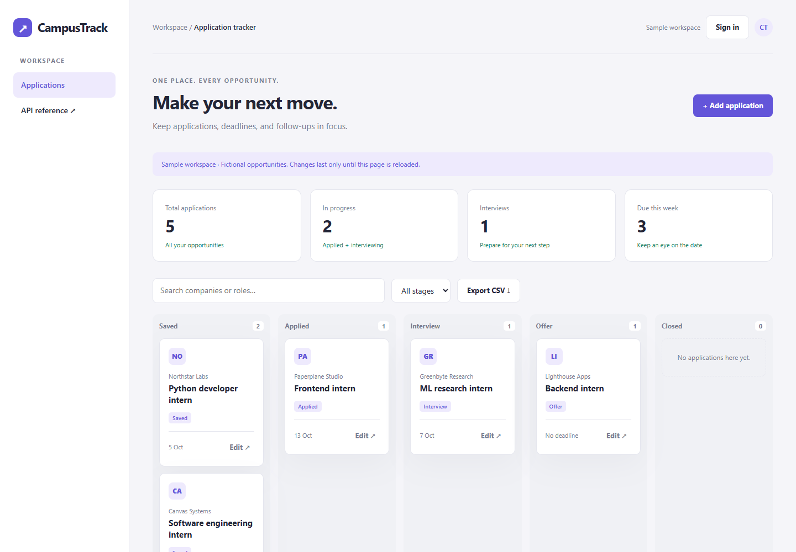

# CampusTrack

A personal internship application tracker with real accounts and a relational database.

**Free browser edition:** deployment in progress. **Account edition:** [live on Render](https://vishnu-campustrack.onrender.com), backed by a free trial database that expires on 31 October 2026.

[Quick start](#run-locally) · [Engineering decisions](#engineering-decisions) · [Code walkthrough](docs/EXPLAINED.md) · [Mobile preview](docs/screenshot-mobile.png)



[](https://github.com/me-vishnurnair/campustrack/actions/workflows/tests.yml)

## Free browser edition

The new `browser/` edition saves your board on the same browser/device and includes JSON backup/restore and CSV export. It uses static hosting and needs no expiring database. [Usage, privacy, deployment and recovery](browser/README.md). The existing account-based Python application remains available separately.

## Features

- Register and sign in using a unique username and password; passwords use salted scrypt hashes.
- Create, edit and delete applications with a company, role, stage, deadline, link and notes.
- Search and filter a five-stage board; see deadline and pipeline counts.
- Export CSV with protection against spreadsheet formula injection.
- Explore a clearly labelled fictional sample board without creating an account.
- Owner-scoped database queries, expiring hashed sessions, CSRF checks, input limits and login throttling.

## Engineering decisions

Account isolation is part of the data model.

| Decision | Reason |
| --- | --- |
| Ownership at the query boundary | Every application operation is scoped to the signed-in owner; hiding a button is not an authorization check. |
| Sessions stored by hash | Passwords use salted scrypt and session tokens are stored as hashes, with expiry and a bounded number of sessions. |
| Durable hosted storage | SQLite keeps local setup small; production requires PostgreSQL instead of a temporary server filesystem. |
| CSV as an input boundary | Exported user text is handled to reduce spreadsheet formula injection. |

**Recorded local verification:** 4 passing backend tests, plus browser and mobile checks. [Test output](docs/test-results.txt). GitHub Actions passed on the published code. Live deployment checks are still pending.

## Tech stack

Python, FastAPI, SQLAlchemy, SQLite/PostgreSQL, HTML, CSS, JavaScript

## Run locally

Use Python 3.12. From this repository's folder:

```powershell
python -m venv .venv
.venv\Scripts\python -m pip install -r requirements-dev.txt
.venv\Scripts\python -m uvicorn app.main:app --reload --host 127.0.0.1 --port 8000
```

On macOS/Linux, replace `.venv\Scripts\python` with `.venv/bin/python`.
Open **http://127.0.0.1:8000**. Interactive API documentation is at **/docs**, and **/healthz** is the health check.

`.env.example` documents configuration names. The application reads environment variables; it does **not** automatically load a `.env` file. Set variables in your shell or hosting dashboard. Never commit real `.env` values.

## Test

```powershell
.venv\Scripts\python -m pytest -q
```

The included GitHub Actions workflow is configured to run these tests on pushes and pull requests; the published code passed its first hosted run. Direct dependencies are pinned to the versions tested for this release.

## Deploy

[Complete the prepared Render deployment](https://render.com/deploy?repo=https://github.com/me-vishnurnair/campustrack) · [Deployment and recovery guide](docs/DEPLOYMENT.md)

`render.yaml` creates a free Python service in Singapore, references the existing `vishnu-campustrack-db` database, derives the HTTPS origin from Render and waits for passing CI before automatic deployments. This Blueprint targets the owner's existing workspace; other users must update the database reference. The remaining dashboard action connects the service without copying credentials into source or chat.

Alternatively, build the included Dockerfile and run the container with the required environment variables. Production traffic should be served over HTTPS.

### Configuration

| Variable | Local default | Hosted requirement |
|---|---|---|
| APP_ENV | development | production |
| APP_ORIGIN | http://127.0.0.1:8000 | Exact HTTPS deployment origin, no trailing slash |
| DATABASE_URL | sqlite:///./campustrack.db | PostgreSQL connection URL in a secret setting |
| COOKIE_SECURE | false locally | true |
| PORT | supplied to Uvicorn | Provided by host |

Production startup refuses an insecure cookie/origin configuration or a local SQLite database. Supply a real PostgreSQL database before publishing. This avoids pretending that a web service's temporary filesystem is durable storage. The free PostgreSQL database has been provisioned and expires on 31 October 2026. The web service still needs the Blueprint deployment. No paid plan has been enabled.

### Limits

This learning release has no email verification, password reset, MFA, administrator console or account deletion screen. Do not use a password reused elsewhere. Sessions expire after 24 hours. There are up to five retained sessions per account and 500 applications per account. Rate limits are per process; use one worker. Before horizontal scaling, use a shared limiter and a proper schema migration workflow. `create_all` initializes tables; it is not a schema migration system.

The sample board uses fictional companies and stores changes only in browser memory. Real account records go to the database. No analytics or external data service is used.

## Understand the code

Read [docs/EXPLAINED.md](docs/EXPLAINED.md) for the request flow, technology choices, limitations and ten interview questions with answers.

## Attribution and license

Original application code created for Vishnu R. Nair with AI assistance. Third-party libraries retain their licenses. The project is an AI-assisted learning build; the owner is working through the implementation. MIT license; see [LICENSE](LICENSE).
